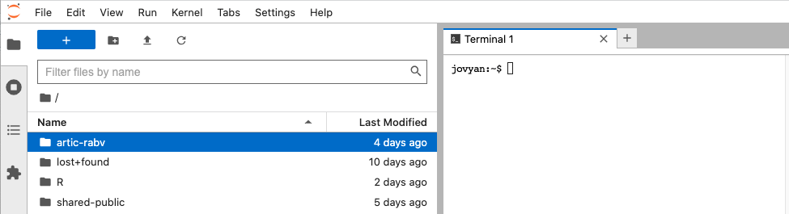
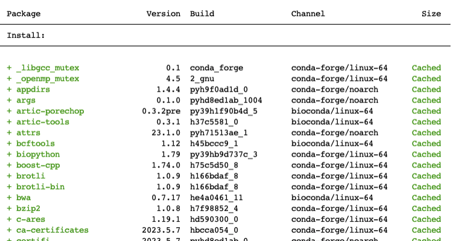

Conda environment
================

- <a href="#1-conda-environment" id="toc-1-conda-environment">1 Conda
  environment</a>
- <a href="#2-clone-artic-rabv-repository"
  id="toc-2-clone-artic-rabv-repository">2 Clone Artic-nf repository</a>
- <a href="#3-create-environment" id="toc-3-create-environment">3 Create
  environment</a>
- <a href="#4-activate-the-environment"
  id="toc-4-activate-the-environment">4 Activate the environment</a>


# 1 Conda environment

Today we will be using a rabies virus version of the [ARTIC
Network’s](https://artic.network/) bioinformatics pipeline. This is a
pipeline and set of accompanying tools for working with viral nanopore
sequence data, generated from tiling amplicon schemes.

This is nicely bundled up for us in a conda environment!

# 2 Creating workshop directory
Create a directory named "workshop_dir" in the home directory and 
locate yourself to workshop_dir. 

``` shell
mkdir /home/rage/workshop_dir
cd /home/rage/workshop_dir
```

# 3 Clone Artic-nf repository

First, we need to “clone” the Artic-nf repository from GitHub. Clone
essentially means we copy the repository from GitHub.com to your local
machine. Enter the command below into terminal.

``` shell
git clone --recursive https://github.com/RAGE-toolkit/Artic-nf.git
```

A folder called Artic-nf should now be visible in the workshop_dir.



# 4 Create environment

The file environment.yml in Artic-nf folder contains the “recipe” to
make our conda environment. Let’s create our environment (using conda):

``` shell
conda env create --file Artic-nf/environment.yml 
```

conda should proceed to install the required packages for the artic-rabv
environment (ignore warnings/errors about libmamba).



At the end you should see an output like this:

``` shell
# To activate this environment, use
#
#     $ conda activate Artic-nf
#
# To deactivate an active environment, use
#
#     $ conda deactivate
```

# 4 Activate the environment

Now we are going to “activate” the environment, which means that we can
access the tools we installed inside it.

Remember, conda environments are self-contained so the tools installed
inside the environment are not available outside of it. You can test
this by running the following command:

``` shell
samtools --help
```

Terminal will say command not found. Now activate the environment:

``` shell
conda activate artic-rabv
```

And try the samtools command again (hint: use the up arrow to find the
command instead of typing it again). It should now give an output
because we installed samtools as part of our environment.

# 5 Backup environment (optional)

In case of network error or conda related issues, we have a backup conda
env preinsalled. This env can be activated using following command.

``` shell
conda activate Artic-nf-backup
```
