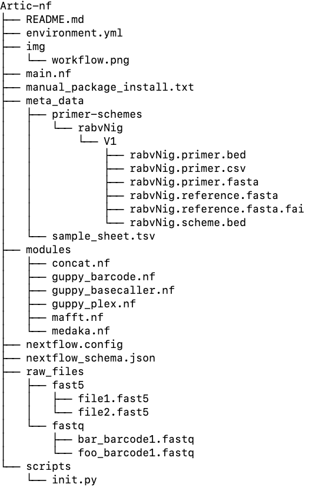

Artic pipeline
================
Kirstyn Brunker
2023-06-29

- <a href="#1-bioinformatic-pipeline" id="toc-1-bioinformatic-pipeline">1
  Bioinformatic pipeline</a>
  - <a href="#11-log-in-to-climb" id="toc-11-log-in-to-climb">1.1 Structure
    of Artic-nf directory</a>
  - <a href="#12-notes-on-these-instructions"
    id="toc-12-notes-on-these-instructions">1.2 Mandatory parameters
    required to run the workflow</a>
  - <a href="#13-activate-the-conda-environment"
    id="toc-13-activate-the-conda-environment">1.3 Activate the conda
    environment</a>
  - <a href="#14-data-organisation" id="toc-14-data-organisation">1.4 Data
    organisation</a>
  - <a href="#15-data" id="toc-15-data">1.5 Data</a>
  - <a href="#16-gather-the-data" id="toc-16-gather-the-data">1.6 Gather the
    data</a>
  - <a href="#17-medaka-pipeline" id="toc-17-medaka-pipeline">1.7 Medaka
    pipeline</a>
  - <a href="#18-looking-at-the-data" id="toc-18-looking-at-the-data">1.8
    Looking at the data</a>
  - <a href="#19-bam-files" id="toc-19-bam-files">1.9 BAM files</a>

# 1 Bioinformatic pipeline

During this practical session will be running the Artic-nf workflow
which requires nextflow and artic packages to be installed on the conda
environment. This workflow processes the raw data (fast5/pod5) to produce the
 consensus sequences.

## 1.1 Structure of Artic-nf directory

Artic-nf workflow contains 6 major components
- <a href="https://github.com/RAGE-toolkit/Artic-nf/blob/main/environment.yml">Evnironment setup</a>
- <a href="https://github.com/RAGE-toolkit/Artic-nf/blob/main/main.nf">Main workflow</a>
- <a href="https://github.com/RAGE-toolkit/Artic-nf/tree/main/meta_data">Meta_data directory</a>
- <a href="https://github.com/RAGE-toolkit/Artic-nf/tree/main/modules">Modules</a>
- <a href="https://github.com/RAGE-toolkit/Artic-nf/blob/main/nextflow.config">Config file</a>
- <a href="https://github.com/RAGE-toolkit/Artic-nf/tree/main/raw_files/fast5">Raw files</a>
- <a href="https://github.com/RAGE-toolkit/Artic-nf/tree/main/scripts">Scripts</a>
- <a href="">Results</a>

<b> Evnironment setup: </b> Conains necessary modules/tools required to
support the workflow. It is recommended use the  <b>environment.yml</b>
file to setup the workflow. Alternatively, manual_package_install.txt can be used to install the package
manually when the environment.yml is unable to run sucessfully.

<b> Main workflow: </b> This enables the execution of the entire workflow.
Generally all the sub-tasks are stiteched together and executed by the
"main.nf" module.

<b> Meta_data directory: </b> This directory contains the sample_sheet,
providing information about the barcode and its corresponding sample
names.

<b> Modules: </b> All the sub workflow's are stored here, enabling in
easy maintanance, replacement and troubleshooting.

<b> Raw files: </b> It is recommended to store the raw fast5/pod5 files
inside raw_file directory to keep the well organized project directory.
Althought program can accept the raw_files from any directory.

<b> Scripts: </b> Any programs/scripts used in the workflow, other than
*.nf are saved in this directory.

<b> Results: </b> All the workflow outputs are stored here in a sub-folders.
This directory is generated during the workflow run. It can be "results" or
"analysis" or in other names (as per the user defination).

Tree structure below may give you a better idea of how the files are organized
in Artic-nf.



## 1.2 Mandatory parameters

The workflow requires some of the mandate parameters to run the workflow, this
includes

- output_dir: To store all the analysis results
- meta_file: Contains barcode and their sample details along with primer schema
  and version
- basecaller: Enables user to select basecaller software [Guppy or Dorado]
- fast5_or_pod5_dir: Directory for raw files
- primer_schema: Directory of primer_schema
- kit_name: Barcode kit name for demux
- dorado_dir: Location of the Dorado software (not required if Guppy is used)
- guppy_dir: Location of the Guppy software (not required if Dorado is used)

## 1.3 Tasks run by the Artic-nf workflow
Artic-nf workflow runs multiple tasks symoultaniously, Here are the list of
tasks run by the Artic-nf.
- Basecalling: Basecalling is performed by the user specified basecalling
  tool
- Barcodering: Performs demultiplexing for the basecalled fastq files
- Plex/demux: Aggregate pre-demultiplexed reads
- Medaka: This steps performs multiple steps related to medaka and data filtering
  Some of the major steps are mentioned below.
  - Alignment
  - Variant calling
  - Variant filter
- Concat: Concatinating all the sequences to a single fasta file
- Mafft: Performing mafft alignment on the concatinated sequence
- Summary: Produces the summary of the aligned reads

The medaka step executes multiple commands, if you are curious to know about the
commands you can have a look at

```shell
less results/medaka/<sample_name>.minion.log.txt
```

## 1.4 Notes on these instructions

This is not simply a copy and paste exercise! The commands you are
instructed to run require some editing, e.g. to tell the pipeline where
your data is. Parts of the commands with \<*some text*\> are highlighing
sections that need your input- i.e. you need to edit the code.

## 1.5 Download Artic-nf and activate the conda environment

First we need to ensure we have access to all the tools needed to run
the pipeline commands. We have a custom conda environment specifically
for this: Artic-nf

``` shell
git clone https://github.com/RAGE-toolkit/Artic-nf.git
cd Artic-nf
conda env create --file environment.yml
conda activate artic_nf
```

## 1.6 Data organisation

It important that raw data is left untouched - we don’t want to risk
modifying these files. We can use it for input but not direct
manipulation of the data. It is best to create a well defined space for
any processed data. Now let us have a look at number of raw data available
and get some more details of it.

------------------------------------------------------------------------

### 1.6.1 Task 1

### 1.6.2

list the number of barcodes available in fastq_pass directory:

``` shell
ls -lh raw_files/fast5/
```

The '-l' in the command to list all the files in a given directory and 'h'
for providing human redable information.

### 1.6.2 Task 2

Similarly, du command can be used provide the disk space occupied by certain
directory or files

``` shell
du -h /home/rage/workshop_dir/Artic-nf
```

The "-h" parameter provides the human readable information, such as showing
each file size in MB/GB instead of bytes. Alternatively you can try without "h"
option to see how the du command prints.

```shell
du /home/rage/workshop_dir/Artic-nf
```

------------------------------------------------------------------------

## 1.7 Running the workflow
Artic-nf can be run in two ways. One with passing all the mandate parameters
to the terminal.

``` shell
nextflow main.nf \
 --meta_file "meta_data/sample_sheet.csv" \
 --fast5_dir "projects/fast5/" \
 --guppy_dir "projects/ont-guppy-cpu/bin/" \
 --primer_schema "projects/Artic-nf/meta_data/primer-schemes/" \
 --guppy_barcode_kits "EXP-NBD104" \
 --output_dir "results"
```

Another method with editing all the parameters in the
**nextflow.config** file.

``` shell
nextflow main.nf
```
________________________________________________________________________

## 1.8 Tasks 3

Go through each folder of the results section and list down the each folders/directory
created by the Artic_nf workflow. Example command given below.

```
ls -lh results/dorado_basecaller
```
